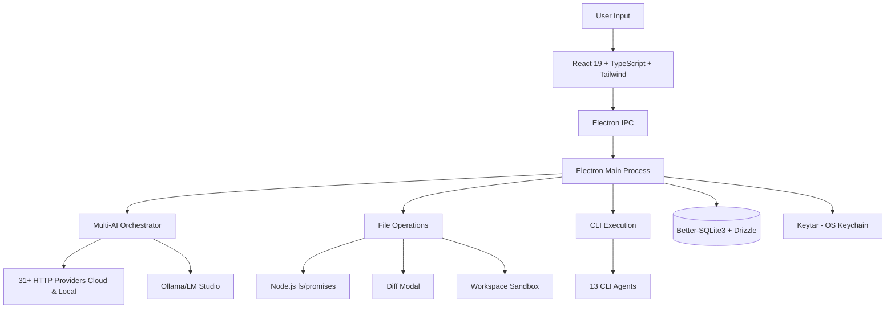

# Project AIDE: AI Desktop Editor - Complete Specification

> Constitution Status: Ratified  
> Stability Tier: Core  
> Last Amended: 2026-01-27

---

## ⚠️ IMPORTANT: Read This First

> **This section is MANDATORY reading for all developers, AI agents, AI assistants, and anyone working with this codebase.**

### Core Architecture Principles

| #   | Principle                        | Description                                                                                                                                                       |
| --- | -------------------------------- | ----------------------------------------------------------------------------------------------------------------------------------------------------------------- |
| 1   | **Models are NEVER hardcoded**   | All AI models are fetched dynamically from provider APIs. See `PROVIDERS.md`. |
| 2   | **User selects the model**       | After adding a provider, user must select a model from the fetched list. `selectedModel` starts as `null`.                                                        |
| 3   | **Priority order matters**       | `openai_compatible` providers first (cost-efficient), `openai` direct last (expensive fallback).                                                                  |
| 4   | **API keys in OS keychain only** | Never store API keys in config files, localStorage, or plain text.                                                                                                |
| 5   | **Diff Modal is sacred**         | File changes must always show a diff view. User must explicitly Accept or Reject. No auto-apply.                                                                  |
| 6   | **Workspace sandboxing**         | All file operations are confined to the user-selected workspace directory.                                                                                        |
| 7   | **No telemetry**                 | The app never phones home. All communication is with user-configured AI providers only.                                                                           |

### Cross-Reference Documents

| Document                                             | Purpose                                                |
| ---------------------------------------------------- | ------------------------------------------------------ |
| [`PROVIDERS.md`](./PROVIDERS.md)                     | AI provider configurations, model fetching, CLI agents |
| [`UI_UX_SPECIFICATION.md`](./UI_UX_SPECIFICATION.md) | UI components, design system, user flows               |
| [`INTELLIGENCE.md`](./INTELLIGENCE.md)               | Advanced AI intelligence features and capabilities     |
| [`SPECIFICATIONS.md`](./SPECIFICATIONS.md)           | Constitutional law — architecture, security, command contracts |
| [`README.md`](./README.md)                           | Quick start, installation, project overview            |

### Key Data Flow

```
1. User adds provider (endpoint + API key)
         ↓
2. App stores API key in OS keychain (encrypted)
         ↓
3. App calls provider's /models endpoint
         ↓
4. User selects model from dropdown
         ↓
5. App saves selectedModel to config
         ↓
6. User can now chat with provider/model
```

### Do's and Don'ts

| ✅ DO                                     | ❌ DON'T                                      |
| ----------------------------------------- | --------------------------------------------- |
| Fetch models from provider API at runtime | Hardcode model names like `"gpt-4"` in code   |
| Use `selectedModel: null` as default      | Use `defaultModel: "gpt-4-turbo"`             |
| Store API keys in OS keychain             | Store API keys in JSON config or localStorage |
| Show diff modal for all file changes      | Auto-apply changes without user confirmation  |
| Confine file operations to workspace      | Allow access to files outside workspace       |

---

## Constitutional Change Process

This document is part of AIDE's **Core constitutional layer**.

Any modification to this file MUST follow these rules:

1. **Amendment Required**  
   Every change must update the `Last Amended` field in the header.

2. **Backward Compatibility Declaration**  
   Changes MUST explicitly state whether they are:
   - Non-breaking (compatible with existing implementations), or
   - Breaking (requires implementation changes in frontend, backend, or providers)

3. **Cross-Document Consistency**  
   If a change affects:
   - AI provider behavior → update `PROVIDERS.md`
   - UI behavior → update `UI_UX_SPECIFICATION.md`
   - Intelligence behavior → update `INTELLIGENCE.md`

4.  **Command Contract Protection**  
   Public IPC handlers (e.g., `run-cli-agent`, `check-cli-availability`, file operations, keychain access) are part of the constitutional API surface and MUST NOT be renamed without a breaking-change declaration.

5. **Human-in-the-Loop Enforcement**  
   No amendment may weaken the diff-and-confirm requirement or workspace sandboxing.

---

## 1. Project Vision

**Project Name:** AIDE (AI Desktop Editor)  
**Tagline:** "Your configurable AI bridge to local files"  
**Core Mission:** Build a secure, privacy-focused desktop application that allows users to chat with their choice of AI provider (OpenAI, Anthropic, OpenRouter, local models, etc.) to directly read, analyze, and edit files within a controlled local workspace, with mandatory user confirmation for all changes.

## 2. Core Features & User Stories

### Feature Set 1: Multi-Provider AI Configuration (MVP Priority: HIGH)

- **As a user,** I can add, configure, and switch between different AI providers in a Settings page.
- **As a user,** I can input my API endpoints and keys, which are stored securely using the OS keychain.
- **As a user,** I can select which configured provider/model is active for my current session.

### Feature Set 2: Secure File System Workspace (MVP Priority: HIGH)

- **As a user,** I select a root directory as my "workspace" on first launch. All file operations are strictly confined to this folder.
- **As a user,** the AI can read the contents of files within my workspace when I ask it to (e.g., "analyze `src/main.js`").
- **As a user,** the AI can propose edits or create new files. I must review a clear **diff view** of all changes and explicitly click **Accept** or **Reject** before anything is written to disk.
- **As a user,** I can see a file tree sidebar of my current workspace.

### Feature Set 3: Core Application Interface (MVP Priority: HIGH)

- **As a user,** I have a clean, familiar chat interface for conversing with the AI.
- **As a user,** I can see a visual indicator of the currently active AI provider.
- **As a user,** I can see a log of file activities (reads, proposed edits, applied changes) in a status panel.
- 🤖 **44 AI Providers** (31 provider templates: 29 cloud + 2 local + 13 CLI agents)

## 3. Technical Architecture & Stack

### 3.1 Mandated Tech Stack

| Component             | Technology                                                  | Why Chosen                                      |
| --------------------- | ----------------------------------------------------------- | ----------------------------------------------- |
| **Desktop Framework** | [Electron 33](https://www.electronjs.org/)                  | Full system access, mature ecosystem, battle-tested |
| **Backend Runtime**   | Node.js 20+ (Electron Main Process)                         | Full npm ecosystem, native module support       |
| **AI HTTP Client**    | Native fetch + EventSource (SSE streaming)                  | Lightweight, provider-agnostic, streaming support |
| **Frontend UI**       | React 19 + TypeScript 5.7 + Tailwind CSS 4.0               | Modern, type-safe UI with utility-first styling |
| **State Management**  | Zustand 5 + TanStack Query v5                               | Lightweight state + robust server-state caching |
| **Local Database**    | Better-SQLite3 + Drizzle ORM v0.36                          | Fastest SQLite for Node.js with type-safe ORM   |
| **Code Editor**       | [Monaco Editor](https://microsoft.github.io/monaco-editor/) | VS Code-grade editing for diff viewer           |
| **UI Components**     | [shadcn/ui v2](https://ui.shadcn.com/)                      | Accessible, customizable components             |
| **Animations**        | Framer Motion v11                                           | Professional, smooth animations                 |
| **UI Polish**         | Sonner (toasts) + Vaul (drawers) + cmdk (command palette)   | Beautiful, accessible UI patterns               |
| **Advanced UI**       | react-tsparticles + react-syntax-highlighter                | Particle effects + animated code blocks         |
| **Icon System**       | [Lucide React v0.460](https://lucide.dev/)                  | Consistent iconography and provider logos       |
| **Dev Tools**         | Vite 6 + Biome 2.0 + Vitest 3 + Playwright 2                | Fast builds, unified tooling, comprehensive testing |
| **Packaging**         | electron-builder v25                                        | Production-ready installers and auto-updates    |

### 3.2 Complete System Architecture



### 3.3 Key Security Model

1.  **File System Sandboxing:** The app enforces strict file access limited to user-selected workspace directory. All file operations are validated before execution in the Main process.
2.  **Credential Storage:** API keys are encrypted and stored using Windows Credential Manager via the `keytar` library (native Node.js module).
3.  **No Telemetry:** The application will not phone home. All communication is strictly between the app and the user's configured AI provider endpoint.

- **Telemetry Definition:** Any data sent to non-user-configured endpoints, including behavioral data, usage statistics, error reports, or content analysis sent to third parties.
- **Exception:** OpenRouter requires `HTTP-Referer` and `X-Title` headers for API ranking. These contain only app identification, not user data.
- **Allowed:** Communication with user-configured AI providers for legitimate AI operations (chat, embeddings, model fetching).
- **Prohibited:** Analytics, crash reporting, usage tracking, content analysis sent to non-configured endpoints.

4.  **Explicit Consent:** The **diff-and-confirm** step is non-optional for the MVP. An "auto-apply" mode may be a configurable setting in the future, defaulting to OFF.

### 3.4 AI Control Plane Architecture

**AIDE uses a single, unified AI control plane to prevent architectural conflicts and ensure consistent behavior.**

#### Single AI Authority

```typescript
// Single source of truth for all AI operations
interface AIControlPlane {
  // Provider Management
  activeProvider: AIProviderConfig | null;
  availableProviders: AIProviderConfig[];
  
  // Model Management  
  selectedModel: string | null;
  availableModels: ModelInfo[];
  
  // Capability Management
  checkCapability(capability: keyof ProviderCapabilities): boolean;
  requireCapability(capability: keyof ProviderCapabilities): void;
  
  // AI Operations (all go through this interface)
  chat(messages: ChatMessage[], options?: ChatOptions): Promise<ChatResponse>;
  generateEmbedding(text: string): Promise<EmbeddingResponse>;
  
  // Fallback Management
  fallbackToNextProvider(): Promise<boolean>;
  handleProviderFailure(error: Error): Promise<void>;
}
```

#### Architecture Rules

| Rule | Description | Enforcement |
|------|-------------|-------------|
| **Single AI Interface** | All AI operations must go through `AIControlPlane` | No direct API clients allowed |
| **Capability Checking** | Check provider capabilities before operations | Throw error if capability missing |
| **Model Validation** | Verify `selectedModel` is not null before AI calls | Prevent undefined model errors |
| **Provider Isolation** | Each provider manages its own models and config | No cross-provider contamination |
| **Graceful Fallback** | Auto-fallback to next provider on failure | Maintain service continuity |

#### Integration with Intelligence Features

```typescript
// Intelligence features must use the control plane
class IntelligenceSystem {
  constructor(private aiControlPlane: AIControlPlane) {}
  
  async analyzeCode(code: string): Promise<Analysis> {
    // Check capability first
    this.aiControlPlane.requireCapability('chat');
    
    // Use control plane for AI operations
    const response = await this.aiControlPlane.chat([{
      role: 'user',
      content: `Analyze this code: ${code}`
    }]);
    
    return parseAnalysis(response.content);
  }
}

// Memory system must use control plane
class MemorySystem {
  constructor(private aiControlPlane: AIControlPlane) {}
  
  async generateEmbedding(text: string): Promise<number[]> {
    // Check capability first
    this.aiControlPlane.requireCapability('embeddings');
    
    // Use control plane for embeddings
    const response = await this.aiControlPlane.generateEmbedding(text);
    return response.embedding;
  }
}
```

#### Preventing Architectural Conflicts

**Before (Conflicting Systems):**
```typescript
// ❌ WRONG: Multiple AI systems
const openaiClient = new OpenAI({ apiKey: "..." });           // System A
const providerSystem = new ProviderOrchestrator();            // System B  
const intelligenceSystem = new IntelligenceSystem();         // System C

// These systems can diverge and conflict
```

**After (Unified Control Plane):**
```typescript
// ✅ CORRECT: Single AI authority
const aiControlPlane = new AIControlPlane(userConfig);
const providerSystem = aiControlPlane;                       // Same system
const intelligenceSystem = new IntelligenceSystem(aiControlPlane); // Uses control plane
const memorySystem = new MemorySystem(aiControlPlane);       // Uses control plane

// All systems use the same AI interface
```

### 3.5 State Management

#### Zustand Stores Structure

````typescript
// stores/provider-store.ts
interface ProviderStore {
  // State
  activeProvider: AIProviderConfig | null; // Currently selected provider
  activeModel: string | null; // Currently selected model (user picks from API)
  providers: AIProviderConfig[]; // All configured providers
  availableModels: ModelInfo[]; // Models fetched from active provider's API
  isConnected: boolean; // Connection status
  isFetchingModels: boolean; // Loading state for model fetching

  // Actions
  setActiveProvider: (provider: AIProviderConfig) => void;
  setActiveModel: (modelId: string) => void;
  addProvider: (provider: AIProviderConfig) => void;
  removeProvider: (id: string) => void;
  updateProvider: (id: string, updates: Partial<AIProviderConfig>) => void;
  fetchModels: (provider: AIProviderConfig) => Promise<void>;
  testConnection: (provider: AIProviderConfig) => Promise<boolean>;
}

// Model info fetched from provider API
interface ModelInfo {
  id: string;
  name: string;
  contextWindow?: number;
  maxTokens?: number;
  description?: string;
}

// stores/workspace-store.ts
interface WorkspaceStore {
  workspacePath: string | null;
  fileTree: FileNode[];
  activeFile: string | null;
  isLoading: boolean;

  setWorkspace: (path: string) => void;
  refreshFileTree: () => Promise<void>;
  setActiveFile: (path: string | null) => void;
}

// stores/chat-store.ts
interface ChatStore {
  messages: Message[];
  isThinking: boolean;
  pendingDiff: DiffProposal | null;
  currentConversationId: string | null;

  addMessage: (message: Message) => void;
  setThinking: (state: boolean) => void;
  proposeDiff: (diff: DiffProposal) => void;
  acceptDiff: () => Promise<void>;
  rejectDiff: () => void;
  clearDiff: () => void;
  startNewConversation: () => void;
}

// stores/ui-store.ts
interface UIStore {
  sidebarOpen: boolean;
  activityLogOpen: boolean;
  commandPaletteOpen: boolean;
  settingsOpen: boolean;
  theme: "light" | "dark" | "system";

  toggleSidebar: () => void;
  toggleActivityLog: () => void;
  toggleCommandPalette: () => void;


  setTheme: (theme: "light" | "dark" | "system") => void;
}


#### Provider Store Implementation Example

```typescript
// stores/provider-store.ts
import { create } from "zustand";
import { persist } from "zustand/middleware";

export const useProviderStore = create<ProviderStore>()(
  persist(
    (set, get) => ({
      activeProvider: null,
      activeModel: null,
      providers: [],
      availableModels: [],
      isConnected: false,
      isFetchingModels: false,

      setActiveProvider: (provider) => {
        set({
          activeProvider: provider,
          activeModel: null,
          availableModels: [],
        });
        // Automatically fetch models when provider is selected
        get().fetchModels(provider);
      },

      setActiveModel: (modelId) => {
        set({ activeModel: modelId });
        // Update the provider's selectedModel in the providers array
        const { activeProvider, providers } = get();
        if (activeProvider) {
          const updated = providers.map((p) =>
            p.id === activeProvider.id ? { ...p, selectedModel: modelId } : p,
          );
          set({ providers: updated });
        }
      },

      fetchModels: async (provider) => {
        set({ isFetchingModels: true });
        try {
          const models = await fetchModelsFromAPI(provider);
          set({ availableModels: models, isConnected: true });
        } catch (error) {
          // Use fallback models if API fails
          const fallback = getFallbackModels(provider.type);
          set({ availableModels: fallback, isConnected: false });
        } finally {
          set({ isFetchingModels: false });
        }
      },

      addProvider: (provider) => {
        // New providers always start with selectedModel: null
        const newProvider = { ...provider, selectedModel: null };
        set({ providers: [...get().providers, newProvider] });
      },

      removeProvider: (id) => {
        set({ providers: get().providers.filter((p) => p.id !== id) });
      },

      updateProvider: (id, updates) => {
        set({
          providers: get().providers.map((p) =>
            p.id === id ? { ...p, ...updates } : p,
          ),
        });
      },

      testConnection: async (provider) => {
        try {
          const modelsEndpoint = provider.config.modelsEndpoint;
          if (!modelsEndpoint) return true; // No endpoint to test

          const response = await fetch(
            `${provider.endpoint}${modelsEndpoint}`,
            {
              headers: getAuthHeaders(provider),
            },
          );
          return response.ok;
        } catch {
          return false;
        }
      },
    }),
    {
      name: "aide-providers",
      // Don't persist sensitive data - API keys are in OS keychain
      partialize: (state) => ({
        providers: state.providers.map((p) => ({ ...p, apiKey: "" })),
        activeProvider: state.activeProvider
          ? { ...state.activeProvider, apiKey: "" }
          : null,
        activeModel: state.activeModel,
      }),
    },
}
```

#### TanStack Query for Model Fetching

```typescript
// hooks/use-models.ts
import { useQuery } from "@tanstack/react-query";
import { useProviderStore } from "@/stores/provider-store";

export function useModels() {
  const { activeProvider } = useProviderStore();

  return useQuery({
    queryKey: ["models", activeProvider?.id, activeProvider?.endpoint],
    queryFn: async () => {
      if (!activeProvider) return [];

      const modelsEndpoint = activeProvider.config.modelsEndpoint;

      // If no models endpoint, use fallback
      if (!modelsEndpoint) {
        return getFallbackModels(activeProvider.type);
      }

      // Fetch live models from API
      const response = await fetch(
        `${activeProvider.endpoint}${modelsEndpoint}`,
        { headers: getAuthHeaders(activeProvider) },
      );

      if (!response.ok) {
        throw new Error("Failed to fetch models");
      }

      const data = await response.json();
      return (
        data.data?.map((m: any) => ({
          id: m.id,
          name: m.id,
          contextWindow: m.context_window,
          maxTokens: m.max_tokens,
        })) || []
      );
    },
    enabled: !!activeProvider,
    staleTime: 5 * 60 * 1000, // 5 minutes cache
    retry: 2,
  });
}

// Fallback models for providers without /models endpoint
function getFallbackModels(providerType: string): ModelInfo[] {
  const fallbacks: Record<string, string[]> = {
    anthropic: [
      "claude-3-5-sonnet",
      "claude-3-opus",
      "claude-3-sonnet",
      "claude-3-haiku",
    ],
    bedrock: [
      "anthropic.claude-3-5-sonnet-20240229-v1:0",
      "anthropic.claude-3-opus-20240229-v1:0",
      "amazon.titan-text-express-v1",
    ],
    ai21: ["j2-ultra", "j2-mid", "j2-light"],
    writer: ["palmyra-x", "palmyra-base"],
    reka: ["reka-core", "reka-flash"],
    inflection: ["inflection-2.5"],
    blackbox: ["blackbox-code", "blackbox-chat"],
    opencode: ["opencode-instruct", "opencode-base"],
  };

  return (fallbacks[providerType] || []).map((id) => ({ id, name: id }));
}
```

### 3.6 Database Schema (Drizzle ORM)

```typescript
// lib/db/schema.ts
import { sqliteTable, text, integer } from "drizzle-orm/sqlite-core";

// Chat history
export const conversations = sqliteTable("conversations", {
  id: text("id").primaryKey(),
  title: text("title").notNull(),
  providerId: text("provider_id").notNull(),
  createdAt: integer("created_at", { mode: "timestamp" }).notNull(),
  updatedAt: integer("updated_at", { mode: "timestamp" }).notNull(),
});

export const messages = sqliteTable("messages", {
  id: text("id").primaryKey(),
  conversationId: text("conversation_id").references(() => conversations.id),
  role: text("role", { enum: ["user", "assistant", "system"] }).notNull(),
  content: text("content").notNull(),
  createdAt: integer("created_at", { mode: "timestamp" }).notNull(),
});

// File operation logs
export const fileOperations = sqliteTable("file_operations", {
  id: text("id").primaryKey(),
  conversationId: text("conversation_id").references(() => conversations.id),
  operation: text("operation", {
    enum: ["read", "write", "create", "delete"],
  }).notNull(),
  filePath: text("file_path").notNull(),
  status: text("status", {
    enum: ["pending", "accepted", "rejected"],
  }).notNull(),
  diff: text("diff"),
  createdAt: integer("created_at", { mode: "timestamp" }).notNull(),
});

// User preferences (non-sensitive)
export const preferences = sqliteTable("preferences", {
  key: text("key").primaryKey(),
  value: text("value").notNull(),
});
```

### 3.7 CLI Agent Integration

#### Execution Strategy

CLI agents (Aider, GPT Engineer, Copilot CLI, etc.) are invoked from the Electron Main process using Node.js `child_process`.

```typescript
// electron/main/cli-agents.ts
import { spawn } from 'child_process';
import { ipcMain } from 'electron';

interface CLIExecutionOptions {
  command: string;
  args: string[];
  workingDir: string;
  envVars: Record<string, string>;
}

// IPC Handler for CLI execution
ipcMain.handle('run-cli-agent', async (event, options: CLIExecutionOptions) => {
  try {
    const { command, args, workingDir, envVars } = options;
    
    return await executeCLIAgent(command, args, workingDir, envVars);
  } catch (error) {
    throw new Error(`CLI execution failed: ${error.message}`);
  }
});

export async function executeCLIAgent(
  command: string,
  args: string[],
  workingDir: string,
  envVars: Record<string, string>
): Promise<string> {
  return new Promise((resolve, reject) => {
    const proc = spawn(command, args, {
      cwd: workingDir,
      env: { ...process.env, ...envVars },
      shell: true
    });
    
    let stdout = '';
    let stderr = '';
    
    proc.stdout.on('data', (data) => {
      stdout += data.toString();
    });
    
    proc.stderr.on('data', (data) => {
      stderr += data.toString();
    });
    
    proc.on('close', (code) => {
      if (code === 0) {
        resolve(stdout);
      } else {
        reject(new Error(stderr || `Process exited with code ${code}`));
      }
    });
    
    proc.on('error', (error) => {
      reject(error);
    });
  });
}

// Check CLI availability
ipcMain.handle('check-cli-availability', async (event, command: string) => {
  try {
    await executeCLIAgent('where', [command], process.cwd(), {});
    return true;
  } catch {
    return false;
  }
});
```

#### Frontend Integration

```typescript
// lib/cli/execute.ts
const { ipcRenderer } = window.electron;

export async function runCLIAgent(
  agent: CLIProviderConfig,
  prompt: string,
): Promise<string> {
  // Get API key from keychain for the agent's required provider
  const envVars: Record<string, string> = {};

  if (agent.config.environmentVars?.OPENAI_API_KEY) {
    envVars.OPENAI_API_KEY = await ipcRenderer.invoke('get-api-key', 'openai');
  }

  return await ipcRenderer.invoke('run-cli-agent', {
    command: agent.command,
    args: [prompt],
    workingDir: agent.workingDirectory || process.cwd(),
    envVars,
  });
}

export async function checkCLIAvailability(command: string): Promise<boolean> {
  return await ipcRenderer.invoke('check-cli-availability', command);
}
```

#### Security Considerations

| Concern             | Mitigation                                           |
| ------------------- | ---------------------------------------------------- |
| Command injection   | Validate `command` against allowlist of known agents |
| Path traversal      | Validate `working_dir` is within workspace           |
| Secret exposure     | API keys passed via env vars, never command args     |
| Arbitrary execution | Only pre-approved CLI agents can be invoked          |

### 3.8 Frontend Component Architecture

#### Component Structure with Animations

```typescript
// src/components/animations/
animations/
├── variants.ts              // Reusable animation variants
├── transitions.ts           // Timing presets
├── micro-interactions.tsx   // Common animations
└── hooks/
    ├── use-hover-lift.ts
    └── use-scale-on-tap.ts
```

#### Animation Variants Library

```typescript
// src/components/animations/variants.ts
import { Variants } from 'framer-motion';

export const fadeInUp: Variants = {
  initial: { opacity: 0, y: 20 },
  animate: { opacity: 1, y: 0 },
  exit: { opacity: 0, y: -20 }
};

export const scaleIn: Variants = {
  initial: { opacity: 0, scale: 0.95 },
  animate: { opacity: 1, scale: 1 },
  exit: { opacity: 0, scale: 0.95 }
};

export const slideInRight: Variants = {
  initial: { x: 100, opacity: 0 },
  animate: { x: 0, opacity: 1 },
  exit: { x: -100, opacity: 0 }
};

export const hoverLift: Variants = {
  initial: { y: 0 },
  hover: { y: -4, boxShadow: "0 10px 25px rgba(0,0,0,0.15)" }
};

export const buttonTap: Variants = {
  tap: { scale: 0.95 }
};
```

#### Transition Presets

```typescript
// src/components/animations/transitions.ts
import { Transition } from 'framer-motion';

export const spring: Transition = {
  type: "spring",
  stiffness: 400,
  damping: 30
};

export const easeOut: Transition = {
  duration: 0.3,
  ease: [0.4, 0, 0.2, 1] // Tailwind's ease-out
};

export const smooth: Transition = {
  duration: 0.5,
  ease: [0.25, 0.1, 0.25, 1] // Custom smooth curve
};
```

#### Reusable Animation Components

```typescript
// src/components/animations/micro-interactions.tsx
import { motion } from 'framer-motion';
import { fadeInUp, hoverLift, buttonTap } from './variants';
import { spring, easeOut } from './transitions';

// Animated Card with hover effect
export const AnimatedCard = ({ children, ...props }) => (
  <motion.div
    variants={hoverLift}
    initial="initial"
    whileHover="hover"
    transition={spring}
    {...props}
  >
    {children}
  </motion.div>
);

// Animated Button with tap effect
export const AnimatedButton = ({ children, ...props }) => (
  <motion.button
    variants={buttonTap}
    whileTap="tap"
    transition={easeOut}
    {...props}
  >
    {children}
  </motion.button>
);

// Fade in wrapper for pages
export const PageTransition = ({ children }) => (
  <motion.div
    variants={fadeInUp}
    initial="initial"
    animate="animate"
    exit="exit"
    transition={easeOut}
  >
    {children}
  </motion.div>
);

// Stagger children animation
export const StaggerContainer = ({ children, ...props }) => (
  <motion.div
    initial="initial"
    animate="animate"
    variants={{
      animate: {
        transition: {
          staggerChildren: 0.1
        }
      }
    }}
    {...props}
  >
    {children}
  </motion.div>
);
```

### 3.9 Animation & Motion System

#### Animation Performance Guidelines

| Principle | Implementation | Why |
|-----------|----------------|-----|
| **Transform over position** | Use `x`, `y` vs `left`, `top` | GPU accelerated |
| **Opacity animations** | Safe to animate | Composited layer |
| **Scale for size changes** | Use `scale` vs `width`/`height` | Smoother performance |
| **Layout animations** | Use `layout` prop sparingly | Can be expensive |
| **Reduce motion** | Respect `prefers-reduced-motion` | Accessibility |

#### Motion Presets

```typescript
// src/lib/utils/motion.ts
export const motionPresets = {
  // Instant animations (for critical interactions)
  instant: { duration: 0 },
  
  // Fast animations (for feedback)
  fast: { duration: 0.15, ease: "easeOut" },
  
  // Normal animations (default)
  normal: { duration: 0.3, ease: [0.4, 0, 0.2, 1] },
  
  // Slow animations (for emphasis)
  slow: { duration: 0.5, ease: [0.25, 0.1, 0.25, 1] },
  
  // Spring animations (for organic feel)
  spring: {
    type: "spring",
    stiffness: 400,
    damping: 30
  },
  
  // Bouncy spring (for playful interactions)
  bouncySpring: {
    type: "spring",
    stiffness: 600,
    damping: 20
  }
};

// Respect user preferences
export const getMotionConfig = () => {
  const prefersReducedMotion = window.matchMedia(
    '(prefers-reduced-motion: reduce)'
  ).matches;
  
  return prefersReducedMotion 
    ? { duration: 0 } // Instant
    : motionPresets.normal;
};
```

### 3.10 Design Token System

#### Spacing Scale

```typescript
// tailwind.config.ts
export default {
  theme: {
    spacing: {
      px: '1px',
      0: '0',
      0.5: '0.125rem',  // 2px
      1: '0.25rem',      // 4px
      1.5: '0.375rem',   // 6px
      2: '0.5rem',       // 8px
      2.5: '0.625rem',   // 10px
      3: '0.75rem',      // 12px
      3.5: '0.875rem',   // 14px
      4: '1rem',         // 16px
      5: '1.25rem',      // 20px
      6: '1.5rem',       // 24px
      7: '1.75rem',      // 28px
      8: '2rem',         // 32px
      9: '2.25rem',      // 36px
      10: '2.5rem',      // 40px
      11: '2.75rem',     // 44px
      12: '3rem',        // 48px
      14: '3.5rem',      // 56px
      16: '4rem',        // 64px
      20: '5rem',        // 80px
      24: '6rem',        // 96px
      28: '7rem',        // 112px
      32: '8rem',        // 128px
      36: '9rem',        // 144px
      40: '10rem',       // 160px
      44: '11rem',       // 176px
      48: '12rem',       // 192px
      52: '13rem',       // 208px
      56: '14rem',       // 224px
      60: '15rem',       // 240px
      64: '16rem',       // 256px
      72: '18rem',       // 288px
      80: '20rem',       // 320px
      96: '24rem',       // 384px
    }
  }
};
```

#### Shadow System

```typescript
// tailwind.config.ts
export default {
  theme: {
    extend: {
      boxShadow: {
        // Elevation system
        'sm': '0 1px 2px 0 rgba(0, 0, 0, 0.05)',
        'DEFAULT': '0 1px 3px 0 rgba(0, 0, 0, 0.1), 0 1px 2px -1px rgba(0, 0, 0, 0.1)',
        'md': '0 4px 6px -1px rgba(0, 0, 0, 0.1), 0 2px 4px -2px rgba(0, 0, 0, 0.1)',
        'lg': '0 10px 15px -3px rgba(0, 0, 0, 0.1), 0 4px 6px -4px rgba(0, 0, 0, 0.1)',
        'xl': '0 20px 25px -5px rgba(0, 0, 0, 0.1), 0 8px 10px -6px rgba(0, 0, 0, 0.1)',
        '2xl': '0 25px 50px -12px rgba(0, 0, 0, 0.25)',
        
        // Colored shadows for emphasis
        'primary': '0 10px 25px -5px rgba(59, 130, 246, 0.3)',
        'success': '0 10px 25px -5px rgba(16, 185, 129, 0.3)',
        'error': '0 10px 25px -5px rgba(239, 68, 68, 0.3)',
        
        // Inner shadow
        'inner': 'inset 0 2px 4px 0 rgba(0, 0, 0, 0.05)',
      }
    }
  }
};
```

#### Border Radius System

```typescript
// tailwind.config.ts
export default {
  theme: {
    borderRadius: {
      'none': '0',
      'sm': '0.125rem',    // 2px
      'DEFAULT': '0.25rem', // 4px
      'md': '0.375rem',    // 6px
      'lg': '0.5rem',      // 8px
      'xl': '0.75rem',     // 12px
      '2xl': '1rem',       // 16px
      '3xl': '1.5rem',     // 24px
      'full': '9999px',
    }
  }
};
```

#### Z-Index Layering System

```typescript
// src/lib/utils/z-index.ts
export const zIndex = {
  base: 0,
  dropdown: 1000,
  sticky: 1100,
  fixed: 1200,
  modalBackdrop: 1300,
  modal: 1400,
  popover: 1500,
  toast: 1600,
  tooltip: 1700,
} as const;

// Usage in components
// className="z-[1400]" or style={{ zIndex: zIndex.modal }}
```

### 3.11 Advanced Visual Architecture

#### Glassmorphism & 3D Rendering Setup

```typescript
// lib/visual-engine/glass-config.ts
export const glassEffects = {
  light: {
    blur: 'backdrop-blur-sm',
    background: 'bg-white/10',
    border: 'border-white/20',
    shadow: 'shadow-lg'
  },
  medium: {
    blur: 'backdrop-blur-md',
    background: 'bg-white/20',
    border: 'border-white/30',
    shadow: 'shadow-xl'
  },
  strong: {
    blur: 'backdrop-blur-xl',
    background: 'bg-white/30',
    border: 'border-white/40',
    shadow: 'shadow-2xl'
  }
};

// 3D transform configuration
export const transform3D = {
  perspective: 1000,
  transformStyle: 'preserve-3d',
  backfaceVisibility: 'hidden'
};
```

#### Particle System Architecture

```typescript
// lib/visual-engine/particle-system.ts
interface ParticleConfig {
  count: number;
  speed: number;
  size: { min: number; max: number };
  color: string;
  opacity: { min: number; max: number };
  connections: boolean;
  interactive: boolean;
}

export const particlePresets: Record<string, ParticleConfig> = {
  subtle: {
    count: 30,
    speed: 0.5,
    size: { min: 1, max: 3 },
    color: '#3b82f6',
    opacity: { min: 0.1, max: 0.3 },
    connections: true,
    interactive: false
  },
  dynamic: {
    count: 50,
    speed: 1,
    size: { min: 2, max: 4 },
    color: '#8b5cf6',
    opacity: { min: 0.2, max: 0.5 },
    connections: true,
    interactive: true
  },
  intense: {
    count: 100,
    speed: 2,
    size: { min: 1, max: 5 },
    color: '#ec4899',
    opacity: { min: 0.3, max: 0.7 },
    connections: true,
    interactive: true
  }
};
```

#### Gradient System Architecture

```typescript
// lib/visual-engine/gradient-system.ts
export const gradientAnimations = {
  // Keyframe animations for smooth gradient transitions
  shift: `
    @keyframes gradient-shift {
      0%, 100% { background-position: 0% 50%; }
      50% { background-position: 100% 50%; }
    }
  `,
  
  rotate: `
    @keyframes gradient-rotate {
      0% { filter: hue-rotate(0deg); }
      100% { filter: hue-rotate(360deg); }
    }
  `,
  
  pulse: `
    @keyframes gradient-pulse {
      0%, 100% { opacity: 1; }
      50% { opacity: 0.7; }
    }
  `
};

// Dynamic gradient generator
export function generateGradient(colors: string[], angle: number = 45): string {
  return `linear-gradient(${angle}deg, ${colors.join(', ')})`;
}
```

### 3.12 Performance Optimization for Advanced UI

#### GPU Acceleration Strategy

```typescript
// lib/performance/gpu-acceleration.ts

// Properties that trigger GPU acceleration
export const gpuAcceleratedProps = [
  'transform',
  'opacity',
  'filter',
  'backdrop-filter'
];

// Properties to avoid (CPU-bound)
export const avoidProps = [
  'width',
  'height',
  'top',
  'left',
  'margin',
  'padding'
];

// Force GPU layer promotion
export const gpuLayer = {
  willChange: 'transform',
  transform: 'translateZ(0)',
  backfaceVisibility: 'hidden',
  perspective: 1000
};
```

#### Layer Management

```typescript
// lib/performance/layer-management.ts

// Compositing layers for complex animations
export const compositeLayers = {
  // Fixed position elements
  header: {
    position: 'fixed',
    willChange: 'transform',
    zIndex: 100
  },
  
  // Animated overlays
  modal: {
    position: 'fixed',
    willChange: 'opacity, transform',
    zIndex: 1000
  },
  
  // Particle backgrounds
  particles: {
    position: 'absolute',
    willChange: 'transform',
    zIndex: -1,
    pointerEvents: 'none'
  }
};
```

#### Performance Monitoring

```typescript
// lib/performance/metrics.ts

export class PerformanceMonitor {
  private fps: number[] = [];
  private frameCount = 0;
  private lastTime = performance.now();
  
  startMonitoring() {
    const measureFrame = () => {
      const currentTime = performance.now();
      const delta = currentTime - this.lastTime;
      
      if (delta > 0) {
        const currentFPS = 1000 / delta;
        this.fps.push(currentFPS);
        
        // Keep only last 60 frames
        if (this.fps.length > 60) {
          this.fps.shift();
        }
      }
      
      this.lastTime = currentTime;
      this.frameCount++;
      
      requestAnimationFrame(measureFrame);
    };
    
    measureFrame();
  }
  
  getAverageFPS(): number {
    return this.fps.reduce((a, b) => a + b, 0) / this.fps.length;
  }
  
  isPerformanceGood(): boolean {
    return this.getAverageFPS() >= 55; // Near 60 FPS
  }
}

// Usage
const perfMonitor = new PerformanceMonitor();
perfMonitor.startMonitoring();

// Check performance every 5 seconds
setInterval(() => {
  if (!perfMonitor.isPerformanceGood()) {
    console.warn('Performance degradation detected');
    // Reduce particle count or disable heavy effects
  }
}, 5000);
```

#### Optimization Techniques

```typescript
// lib/performance/optimization.ts

// Debounce expensive operations
export function debounce<T extends (...args: any[]) => any>(
  func: T,
  wait: number
): (...args: Parameters<T>) => void {
  let timeout: NodeJS.Timeout;
  return (...args: Parameters<T>) => {
    clearTimeout(timeout);
    timeout = setTimeout(() => func(...args), wait);
  };
}

// Throttle animation callbacks
export function throttle<T extends (...args: any[]) => any>(
  func: T,
  limit: number
): (...args: Parameters<T>) => void {
  let inThrottle: boolean;
  return (...args: Parameters<T>) => {
    if (!inThrottle) {
      func(...args);
      inThrottle = true;
      setTimeout(() => (inThrottle = false), limit);
    }
  };
}

// Intersection Observer for lazy animations
export function createAnimationObserver(
  callback: (entries: IntersectionObserverEntry[]) => void
) {
  return new IntersectionObserver(callback, {
    threshold: 0.1,
    rootMargin: '50px'
  });
}

// Usage: Only animate when element is visible
const observer = createAnimationObserver((entries) => {
  entries.forEach(entry => {
    if (entry.isIntersecting) {
      // Start animation
      entry.target.classList.add('animate');
    } else {
      // Stop animation to save resources
      entry.target.classList.remove('animate');
    }
  });
});
```

#### Memory Management

```typescript
// lib/performance/memory-management.ts

export class MemoryManager {
  private cache = new Map<string, any>();
  private maxSize = 100;
  
  set(key: string, value: any): void {
    if (this.cache.size >= this.maxSize) {
      // Remove oldest entry (LRU)
      const firstKey = this.cache.keys().next().value;
      this.cache.delete(firstKey);
    }
    this.cache.set(key, value);
  }
  
  get(key: string): any {
    return this.cache.get(key);
  }
  
  clear(): void {
    this.cache.clear();
  }
  
  // Clean up animation frames
  cleanupAnimations(): void {
    // Cancel all pending animation frames
    const highestId = requestAnimationFrame(() => {});
    for (let i = 0; i < highestId; i++) {
      cancelAnimationFrame(i);
    }
  }
}
```

#### Critical Rendering Path Optimization

```typescript
// vite.config.ts - Production optimizations
export default defineConfig({
  build: {
    rollupOptions: {
      output: {
        manualChunks: {
          // Separate vendor chunks
          'react-vendor': ['react', 'react-dom'],
          'motion-vendor': ['framer-motion'],
          'ui-vendor': ['@radix-ui/react-dialog', '@radix-ui/react-dropdown-menu'],
          'particles': ['react-tsparticles', 'tsparticles']
        }
      }
    },
    // Minification
    minify: 'terser',
    terserOptions: {
      compress: {
        drop_console: true,
        drop_debugger: true
      }
    },
    // CSS optimization
    cssCodeSplit: true,
    cssMinify: true
  },
  // Optimize dependencies
  optimizeDeps: {
    include: ['framer-motion', 'react-tsparticles']
  }
});
```

### 4. Complete Feature Set

AIDE delivers a revolutionary development environment with the following complete feature set:

### Core AI Features

- 🤖 **43 AI Providers** (31 provider templates: 29 cloud + 2 local + 12 CLI agents)
- 🔄 **Dynamic Model Fetching**: Models fetched live from provider APIs
- 💬 **Streaming Chat Interface**: Real-time AI conversations

### Workspace & Security

- � **Secure File Operations**: Read and edit files with mandatory user confirmation
- 🏝️ **Workspace Sandboxing**: Strict file access limited to user-selected directories
- 🔍 **Diff Viewer**: Clear visual diffs for all proposed changes
- 🔐 **OS Keychain Storage**: API keys stored in hardware-secured keychains

### Development Experience

- 🎨 **Clean UI**: Modern, responsive interface
- ⚡ **Fast Performance**: Optimized with Electron's V8 engine and native Node.js modules
- �️ **CLI Agent Integration**: Execute AI tools like Aider, Copilot CLI

## 5. Detailed User Workflow (MVP)

### 5.1 Launch

User opens the AIDE application for the first time.

### 5.2 First-Time Provider Setup

1. App detects no configured provider and opens the **Settings** modal.
2. User selects provider type from options:
   - `OpenAI Compatible (Generic)` - for custom endpoints
   - `OpenRouter` - preconfigured
   - `Groq` - preconfigured
   - etc.
3. User enters the API endpoint (pre-filled for known providers).
4. User pastes their API key.
5. User clicks **"Test Connection"** button.
   - Button shows spinner while testing.
   - On success: Green checkmark appears.
   - On failure: Red error message with retry option.
6. User clicks **"Save"** → Provider is saved with `selectedModel: null`.

### 5.3 Model Selection

1. After saving provider, app automatically fetches models from `/models` endpoint.
2. A loading spinner appears: "Fetching available models..."
3. Model dropdown populates with live models from the API.
4. User selects a model (e.g., `anthropic/claude-3-5-sonnet`).
5. App saves the selection and shows toast: "Now using claude-3-5-sonnet with OpenRouter".
6. **Edge Case:** If model fetch fails:
   - Show warning: "Could not fetch models. Using cached list."
   - Display fallback models (if available for provider type).
   - If no fallback, show error and prompt to check API key.

### 5.4 Select Workspace

1. A prominent button says **"Select Workspace Folder"**.
2. User clicks → Native file picker opens.
3. User chooses a directory (e.g., `~/projects/my_app`).
4. App saves this path and displays it in the status bar.
5. Workspace is now active for all file operations.

### 5.5 Making a Request

1. In the main chat input, user types:
   > "Please read `src/main.js` and add a console.log statement at the start of the function."
2. User hits Enter or clicks Send button.

### 5.6 App Processing

1. UI shows "AI is thinking..." indicator.
2. Status bar updates to: `Thinking...`
3. Backend process:
   - LangChain Agent receives the prompt.
   - Agent uses "read file" tool (Tauri command) to fetch `src/main.js`.
   - Agent sends prompt + file content to configured AI provider.
   - Agent receives code suggestion.
   - Agent uses "create edit proposal" tool to generate a diff.

### 5.7 User Confirmation (Diff Modal)

1. A modal pops up titled: **"Review Changes to src/main.js"**
2. Modal shows side-by-side diff view:
   - Left side: Original code (red highlighting for deletions)
   - Right side: New code (green highlighting for additions)
3. Action buttons at bottom:
   - **[Reject]** - Secondary button, discards changes
   - **[Accept & Apply]** - Primary button, applies changes
   - **[Copy Changes]** - Text button, copies diff to clipboard

### 5.8 Completion

1. **If user clicks Accept:**
   - Electron Main process writes new content to file.
   - Modal closes instantly (no animation).
   - Toast appears: "✓ Changes applied to src/main.js"
   - Chat shows system message: "✓ Changes applied to `src/main.js`."
   - Activity log (future) adds entry.
2. **If user clicks Reject:**
   - Modal closes.
   - Toast appears: "Changes discarded"
   - Chat shows system message: "Changes to `src/main.js` were rejected."
   - Original file remains untouched.
3. Conversation continues - user can make more requests.

### 5.9 Visual State Summary

| State       | UI Indicator                    | Status Bar       |
| ----------- | ------------------------------- | ---------------- |
| Ready       | Chat input enabled              | "Ready"          |
| Thinking    | Input disabled, spinner in chat | "Thinking..."    |
| Diff Review | Modal open, app dimmed          | "Review changes" |
| Applying    | Modal shows spinner             | "Applying..."    |
| Complete    | Modal closed, toast shown       | "Ready"          |
| Error       | Error toast, modal closed       | "Error"          |

## 6. Detailed Specifications

For complete implementation details, see these dedicated documents:

- **User Interface & Experience:** Refer to [UI_UX_SPECIFICATION.md](./UI_UX_SPECIFICATION.md)
  - **Provider Selector:** Section 4.1 - Cards with status badges, model dropdowns, connection indicators
  - **Icon System:** Section 2.3 - Lucide React icons, provider logos, fallback icons
  - **Visual Components:** Section 7 - Button, Card, Badge, Modal components with TypeScript interfaces
  - **Connection Status:** Section 4.1 & 4.7 - Visual indicators for provider connection states
- **AI Provider Configurations:** Refer to [PROVIDERS.md](./PROVIDERS.md)
- **Security Model:** See Section 3.3 of this document

## 7. File Structure (Complete)

```
aide-desktop/
├── src/
│   ├── components/
│   │   ├── ui/                    # shadcn/ui components (Button, Card, Badge)
│   │   │   ├── button.tsx
│   │   │   ├── card.tsx
│   │   │   ├── badge.tsx          # Status and type badges
│   │   │   ├── dialog.tsx
│   │   │   ├── command.tsx        # CMDK wrapper
│   │   │   ├── drawer.tsx         # Vaul wrapper
│   │   │   └── sonner.tsx         # Toast wrapper
│   │   ├── chat/
│   │   │   ├── chat-container.tsx
│   │   │   ├── chat-input.tsx
│   │   │   ├── message-bubble.tsx
│   │   │   └── typing-indicator.tsx
│   │   ├── diff/
│   │   │   ├── diff-modal.tsx
│   │   │   └── diff-viewer.tsx    # Monaco diff
│   │   ├── providers/
│   │   │   ├── provider-selector.tsx  # Model selector, connection status
│   │   │   ├── provider-card.tsx      # Cards with badges and icons
│   │   │   └── model-dropdown.tsx     # Dynamic model selection
│   │   ├── sidebar/
│   │   │   ├── file-tree.tsx
│   │   │   └── activity-log.tsx
│   │   └── layout/
│   │       ├── header.tsx
│   │       ├── status-bar.tsx
│   │       └── command-palette.tsx
│   ├── lib/
│   │   ├── ai/
│   │   │   ├── providers.ts       # Provider HTTP client
│   │   │   ├── chat.ts            # Streaming chat implementation
│   │   │   ├── tools.ts           # File read/write tools
│   │   │   ├── model-discovery.ts # Dynamic model fetching
│   │   │   └── agent.ts           # AI agent setup
│   │   ├── cli/
│   │   │   ├── execute.ts         # CLI agent execution
│   │   │   └── detection.ts       # CLI binary detection
│   │   ├── db/
│   │   │   ├── index.ts           # Database client
│   │   │   ├── schema.ts          # Drizzle schema
│   │   │   └── queries.ts         # Typed queries
│   │   └── utils/
│   │       ├── file-utils.ts
│   │       └── diff-utils.ts
│   ├── stores/
│   │   ├── provider-store.ts
│   │   ├── workspace-store.ts
│   │   ├── chat-store.ts
│   │   └── ui-store.ts
│   ├── hooks/
│   │   ├── use-ai.ts              # AI chat hook
│   │   ├── use-file-operations.ts
│   │   ├── use-keyboard-shortcuts.ts
│   ├── styles/
│   │   └── globals.css
│   ├── App.tsx
│   └── main.tsx
├── electron/
│   ├── main/
│   │   ├── index.js               # Main entry point
│   │   ├── ipc-handlers/
│   │   │   ├── file-ops.js        # read_file, write_file
│   │   │   ├── workspace.js       # select_workspace
│   │   │   ├── keychain.js        # secure storage
│   │   │   └── cli-agents.js      # CLI agent execution
│   │   └── config.js              # App configuration
│   └── preload/
│       └── index.js               # IPC bridge
├── tests/
│   ├── unit/
│   │   ├── stores.test.ts
│   │   └── utils.test.ts
│   ├── e2e/
│       ├── chat.spec.ts
│       └── file-ops.spec.ts
├── drizzle/
│   └── migrations/                # Database migrations
├── .github/
│   └── workflows/
│       └── ci.yml                 # GitHub Actions
├── biome.json                     # Biome config
├── drizzle.config.ts             # Drizzle config
├── playwright.config.ts          # Playwright config
├── vitest.config.ts              # Vitest config
├── tailwind.config.ts
├── tsconfig.json
├── package.json
├── pnpm-lock.yaml
├── README.md
├── SPECIFICATIONS.md
├── PROVIDERS.md
└── UI_UX_SPECIFICATION.md
```

### Configuration Files

| File                | Purpose                                                     |
| ------------------- | ----------------------------------------------------------- |
| `drizzle.config.ts` | Database connection and migration settings for Drizzle ORM  |
| `biome.json`        | Linting and formatting rules (replaces ESLint + Prettier)   |
| `electron-builder.yml` | Electron app packaging and build configuration           |

## 8. Success Metrics for MVP

### Functional Metrics

| Metric             | Target       | How to Measure                                 |
| ------------------ | ------------ | ---------------------------------------------- |
| Time to first edit | < 5 minutes  | From fresh install to accepted file edit       |
| Provider setup     | < 2 minutes  | From opening settings to successful connection |
| Model selection    | < 30 seconds | From provider selection to model chosen        |
| File edit flow     | < 1 minute   | From request to diff modal appearing           |

### Performance Metrics

| Metric                | Target        | Measurement                                    |
| --------------------- | ------------- | ---------------------------------------------- |
| App startup time      | < 3 seconds   | From click to fully loaded UI                  |
| File tree loading     | < 1 second    | For projects up to 10,000 files               |
| Model fetching        | < 5 seconds   | API call to populate dropdown                  |
| Memory usage          | < 200 MB      | Idle state with workspace loaded               |
| Large file handling   | Files up to 1MB | Diff viewer performance                      |
| Concurrent requests   | 3 simultaneous | Multiple AI conversations                     |

### Security Metrics

| Metric               | Target         | Verification                                         |
| -------------------- | -------------- | ---------------------------------------------------- |
| API key storage      | 100% encrypted | Keys only in OS keychain, never in files             |
| Workspace sandboxing | 100% enforced  | No file access outside selected folder               |
| Telemetry            | Zero           | No network calls except to user-configured providers |
| Diff confirmation    | 100% required  | No file writes without explicit user approval        |

### Reliability Metrics

| Metric         | Target            | Verification                               |
| -------------- | ----------------- | ------------------------------------------ |
| Diff accuracy  | 100%              | Diff view exactly matches proposed changes |
| Accept action  | 100% reliable     | File correctly updated on accept           |
| Reject action  | 100% reliable     | File unchanged on reject                   |
| Model fetch    | Graceful fallback | Fallback models shown if API fails         |
| Error handling | User-friendly     | All errors show clear, actionable messages |

### User Experience Metrics

| Metric          | Target                                  |
| --------------- | --------------------------------------- |
| Provider status | Always visible (connected/disconnected) |
| Active model    | Always visible in header                |
| Thinking state  | Always visible (spinner + status bar)   |
| File context    | Clear which file is being discussed     |


````

### 9. Offline & Fallback Strategy

#### Network Resilience

| Scenario | Behavior | User Experience |
|----------|----------|-----------------|
| **Internet Down** | Switch to local providers (Ollama, LM Studio) | "Switched to local model due to network issues" |
| **Provider API Down** | Fallback to next priority provider | "OpenRouter unavailable, using Groq instead" |
| **Model Fetch Fails** | Use cached/fallback model list | "Using cached models for this provider" |
| **Streaming Interrupted** | Graceful retry with exponential backoff | Progress indicator with retry count |

#### Local-First Features

```typescript
// Features that work offline
const offlineCapabilities = {
  fileOperations: true,     // Read, write, diff files
  workspaceNavigation: true, // File tree, search
  syntaxHighlighting: true,  // Code display
  diffViewer: true,         // Compare changes
  settingsManagement: true,  // Configure providers
  conversationHistory: true, // View past chats
  
  // Requires internet
  aiChat: false,            // Needs provider API
  modelFetching: false,     // Needs provider API
  providerTesting: false    // Needs provider API
};
```

#### Graceful Degradation

- **No Internet**: Show clear offline indicator, suggest local providers
- **Slow Connection**: Show progress indicators, allow cancellation
- **API Errors**: Display helpful error messages with retry options
- **Rate Limits**: Automatic backoff with user notification
### 10. Developer Experience (DX) Enhancements

#### Hot Reload & Development

```typescript
// Development-specific features
interface DevModeFeatures {
  hotReload: boolean;           // Instant UI updates
  debugMode: boolean;           // Verbose logging
  mockProviders: boolean;       // Test without API keys
  performanceMetrics: boolean;  // Real-time performance data
  errorBoundaries: boolean;     // Graceful error handling
}
```

#### Debug & Diagnostics

| Feature | Purpose | Implementation |
|---------|---------|----------------|
| **Request Logging** | Debug API calls | Log all provider requests/responses |
| **Performance Monitor** | Identify bottlenecks | Track render times, memory usage |
| **Error Reporting** | Crash diagnostics | Structured error logs with context |
| **Health Checks** | System status | Provider connectivity, file permissions |

#### Developer Tools Integration

- **VS Code Extension**: Quick AIDE integration
- **CLI Tool**: Batch operations and automation
- **API Endpoints**: Programmatic access to AIDE features
- **Plugin System**: Third-party extensions